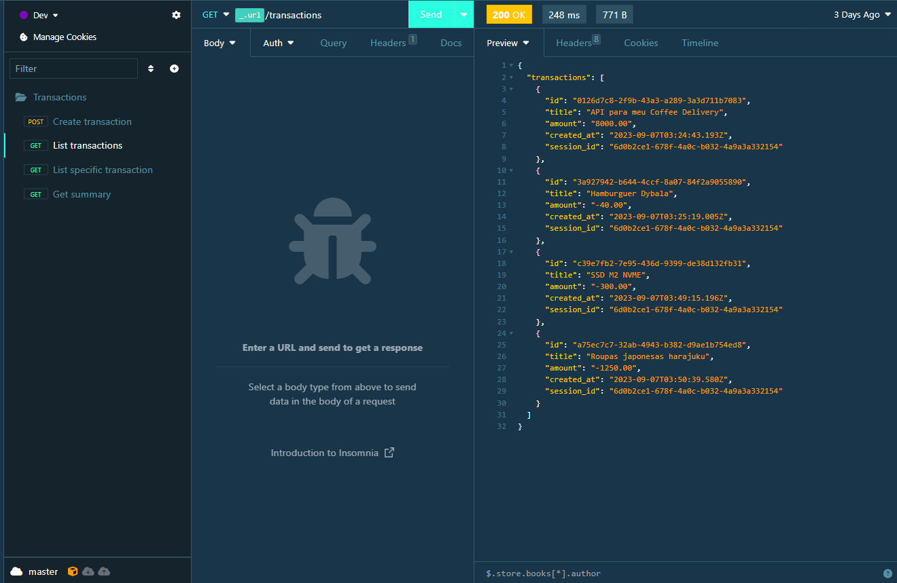

# [Transactions_RestAPI](https://restapi-tasks.onrender.com/)

<p align="center">
  

   <a href="https://github.com/YourUsername/Transactions_RestAPI/commits/master">
    
  </a>

   <a href="https://restapi-tasks.onrender.com/">
    
  </a>
  
</p>



> Project developed during the Node.js track of Rocketseat's Ignite Bootcamp, focusing on creating and managing user transactions.

## About the project

The Transactions_RestAPI project allows users to create new transactions, obtain an account summary, list all previous transactions, and view specific transactions. Transactions can be of either credit, which adds to the total value, or debit, which subtracts from it. User authentication is implemented to ensure data privacy. Additionally, users can only view transactions they have created.

## Routes

### `GET - /`

Returns all transactions created by the authenticated user.

### `GET - /:id`

Returns the details of a specific transaction, identified by its ID.

### `GET - /summary`

Returns a summary of the total transaction amount for the authenticated user.

### `POST - /`

Creates a new transaction associated with the authenticated user. Requires the following information in the request body:

- `title` - Transaction title
- `amount` - Transaction amount
- `type` - Type of transaction (credit/debit)

## Technologies Used

- **[NodeJS](https://nodejs.org)**
- **[Fastify](https://github.com/fastify/fastify)**
- **[Fastify/cookie](https://github.com/fastify/fastify-cookie)**
- **[Knex](http://knexjs.org/)**
- **[Zod](https://github.com/colinhacks/zod)**
- **[Vitest](https://github.com/vitejs/vite)**
- **[Supertest](https://github.com/visionmedia/supertest)**
- **[Sqlite](https://github.com/sqlite/sqlite)**
- **[PostgreSQL](https://www.postgresql.org/)**

## 🚀 Testing Transactions_RestAPI

 
```bash

# Clone this repository
$ git clone git@github.com:GianDutra/Transactions_RestAPI.git

# Access the project folder in your terminal
$ cd Transactions_RestAPI

# Install the dependencies
$ npm install

# Run the application in developer mode
$ npm run dev

# Access the API
To test the routes and interact with the API, you can use a tool like Insomnia or Postman. Follow these steps:

1. Open Insomnia or Postman on your computer.

2. Create a new request for each API route you want to test (e.g., POST, GET).

3. Set the request URL to http://localhost:3333, which is the default address where your API should be running.

4. Configure the request method and add any required headers or request body parameters according to the route you want to test.
```


---


## 👨‍💼 Author

<table>
  <tr>
    <td align="center">
      <a href="#">
        <br>
        <sub>
          <b>Gian Dutra</b>
        </sub>
      </a>
    </td>
  </tr>
</table>
